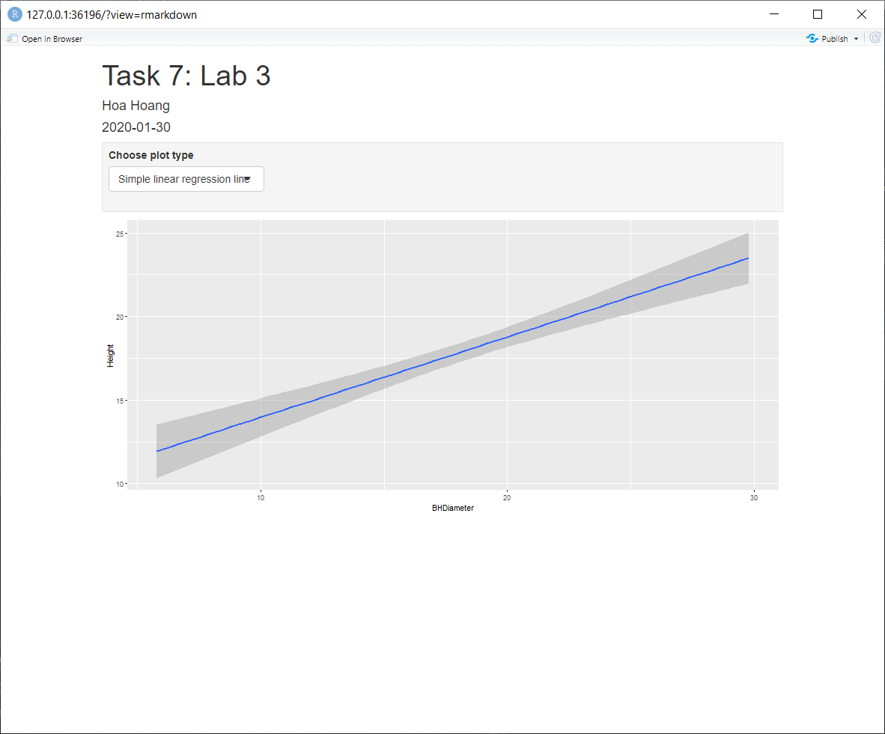

```{r setup, include=FALSE}
knitr::opts_chunk$set(echo = TRUE)
```

## Task 1
```{r}
getwd()
```

## Task 2
```{r}
spruce=read.csv("SPRUCE.csv")
head(spruce,6)
```
## Task 3
### Make a scatter plot of the data
```{r}
with(spruce,plot(BHDiameter, Height, main="SPRUCE",
   xlab="BHDiameter", ylab="Height", pch=21, bg="Blue", cex=1.2,
   xlim=c(0, 1.1*max(BHDiameter)),ylim=c(0, 1.1*max(Height))))
```

### Does there appear to be a straight line relationship?
  >NO, it appears somewhat curved

### Using trendscatter()
```{r}
library(s20x)
layout(matrix(1:4,nr=2,nc=2,byrow=TRUE))
with(spruce,trendscatter(Height ~ BHDiameter , f=0.5, main = "f=0.5"))
with(spruce,trendscatter(Height ~ BHDiameter, f=0.6, main = "f=0.6"))
with(spruce,trendscatter(Height ~ BHDiameter, f=0.7, main = "f=0.7"))
```

### Linear model object and new scatterplot
```{r}
spruce.lm= with(spruce, lm(Height ~ BHDiameter))
lo <-with(spruce, loess(Height ~ BHDiameter))
with(spruce,plot(BHDiameter, Height, main="SPRUCE",
   xlab="BHDiameter", ylab="Height", pch=21, bg="Blue", cex=1.2,
   xlim=c(0, 1.1*max(BHDiameter)),ylim=c(0, 1.1*max(Height))))
abline(spruce.lm,col="red")
xl <- with(spruce,seq(min(BHDiameter),max(BHDiameter), (max(BHDiameter) - min(BHDiameter))/1000))
lines(xl, predict(lo,xl), col='black', lwd=2)
```

### Comment
  > The straight line look a bit off. The smooth curve fit better
  
## Task 4
```{r}
layout(matrix(1:4,nr=2,nc=2,byrow=TRUE))
##Graph 1
with(spruce,plot(BHDiameter, Height, main="Fit line",
   xlab="BHDiameter", ylab="Height", pch=21, bg="Blue", cex=1.2,
   xlim=c(0, 1.1*max(BHDiameter)),ylim=c(0, 1.1*max(Height))))
abline(spruce.lm,col="red")
##Graph 2
with(spruce,plot(BHDiameter, Height, main="With RSS",
   xlab="BHDiameter", ylab="Height", pch=21, bg="Blue", cex=1.2,
   xlim=c(0, 1.1*max(BHDiameter)),ylim=c(0, 1.1*max(Height))))
yhat=with(spruce,predict(spruce.lm,data.frame(BHDiameter)))
with(spruce,{
segments(BHDiameter,Height,BHDiameter,yhat)
})
abline(spruce.lm, col="red")
RSS=with(spruce,sum((Height-yhat)^2))
RSS
##Graph 3
with(spruce,plot(BHDiameter, Height, main="Mean of Height vs BHDiameter",
   xlab="BHDiameter", ylab="Height", pch=21, bg="Blue", cex=1.2,
   xlim=c(0, 1.1*max(BHDiameter)),ylim=c(0, 1.1*max(Height))))
with(spruce, abline(h=mean(Height)))
abline(spruce.lm,col="red")
with(spruce, segments(BHDiameter,mean(Height),BHDiameter,yhat,col="red"))
MSS=with(spruce,sum((yhat-mean(Height))^2))
MSS
##Graph 4
with(spruce,plot(BHDiameter, Height, main="With total deviation line segments",
   xlab="BHDiameter", ylab="Height", pch=21, bg="Blue", cex=1.2,
   xlim=c(0, 1.1*max(BHDiameter)),ylim=c(0, 1.1*max(Height))))

with(spruce,abline(h=mean(Height)))
with(spruce, segments(BHDiameter,Height,BHDiameter,mean(Height),col="green"))
```

### TSS,RSS,MSS 
```{r}
TSS=with(spruce,sum((Height-mean(Height))^2))
TSS
MSS
RSS 
```

### MSS/TSS
```{r}
MSS/TSS
```
> This number is our coefficient of determination. It is 0.66 meaning that only about 66% of the data
fit the model. Therefore, this linear model is not very good

### Does TSS=MSS+RSS
```{r}
MSS+RSS
```
  > Yes

## Task 5
### Summarize spruce.lm 
```{r}
summary(spruce.lm)
coef(spruce.lm)
```
### What is the value of the slope?
  > 0.4814743
  
### What is the value of the intercept?
  > 9.1468390   
  
### Write down the equation of the fitted line.
  > Height = 9.1468390 + 0.4814743*BHDiameter
  
### Predict the Height of spruce when the Diameter is 15, 18 and 20cm 
```{r}
  predict(spruce.lm, data.frame(BHDiameter=c(15,18,20)))
```

## Task 6
```{r}
library(ggplot2)
g=ggplot(spruce, aes(x=BHDiameter,y=Height,colour=BHDiameter))
g=g+geom_point() + geom_line()+ geom_smooth(method="lm")
g+ggtitle("Height Vs BHDiameter")
```

## Task 7
{ width=70% }
{ width=70% }
{ width=70% }


